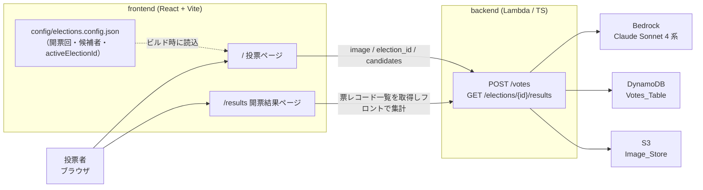

# tegaki-vote-app

手書き投票デモアプリ。日本語の候補者名をブラウザの Canvas に手書きして「投票」すると、Amazon Bedrock のマルチモーダル LLM（Claude Sonnet 4 系）が画像を読み取り、候補者リストとの一致可否から **有効票 / 無効票** を判定して即座に結果を返す、エンタメ / デモ / 学習用のネタアプリです。

本アプリは **PoC（概念実証）** であり、シンプルで理解しやすい構成を優先しています。

> **デモ用途の前提（重要）**
> 本物の投票システムに求められる **匿名性・改竄防止・二重投票防止・監査証跡は対象外** です。また判定基準となる **候補者リストはクライアント（フロント）由来** で投票リクエストに含めて送るため、その真正性・整合性の保証も対象外とします（PoC 前提）。

## 全体像



## 技術スタック

- **フロントエンド**: React + Vite + Canvas API + Framer Motion + react-router-dom（v6, 2 ページ構成）
- **バックエンド**: AWS Lambda（Node.js / TypeScript）。受付・解析・保存を 1 つの Lambda 内モジュールに分割
- **画像解析**: Amazon Bedrock マルチモーダル LLM（Claude Sonnet 4 系）
- **データストア**: DynamoDB（投票レコード）
- **画像保管 / 配信**: S3 + CloudFront（OAC）
- **IaC**: AWS CDK（TypeScript）
- **構成**: monorepo（npm workspaces / `frontend` `backend` `infra` `shared`）

## クイックスタート

依存はルートで一括インストールします（npm workspaces）。

```bash
npm install
```

フロントは MSW（Mock Service Worker）でバックエンド API をモックするため、**backend や AWS が無くても単体で起動**できます。

```bash
cd frontend
npm run dev
```

`http://localhost:5173` で起動します。

- `/` … 投票ページ（手書き → 投票 → 「投票されました」表示）
- `/results` … 開票結果ページ（アクティブ開票回の集計を表示）

dev 起動時はデフォルトで MSW モックが有効です。実 backend に向ける場合は `VITE_ENABLE_MOCKS=false` を設定し、`VITE_API_BASE_URL` に API のオリジンを指定します。

## 開票回・候補者の変更方法

開票回（Election）と候補者、および現在投票を受け付けているアクティブ開票回は、**フロントエンド専用の設定ファイル** で管理します（backend は開票回・候補者の定義を一切持ちません）。

- 設定ファイル: `frontend/src/config/elections.config.json`
- 形式: `{ "activeElectionId": string, "elections": [{ "election_id", "title", "candidates": [{ "id", "name" }] }] }`

変更手順:

1. `activeElectionId` を編集して、現在投票を受け付けるアクティブ開票回を切り替える（投票者は選択できません。フロントが固定表示します）。
2. `round-2` / `round-3` は候補者が空のプレースホルダです。運用するシーンに合わせて `candidates` を追加します。
3. 変更後はビルド / 再起動（`npm run dev` の再起動、または再ビルド）で反映されます。設定は **ビルド時** に検証・確定されます。

初期状態は `round-1`（候補者: まるまる / バツバツ / 三角三角）がアクティブです。

## リポジトリ構成

```
tegaki-vote-app/
├── frontend/   # React + Vite アプリ（Canvas・投票 UI・開票結果ページ・フロント集計）
├── backend/    # Lambda（受付 Receiver / 解析 Analyzer / 保存 Storage）。開票回定義は持たない
├── infra/      # AWS CDK（静的配信スタック + API スタック）
├── shared/     # 型定義・API 契約のみ（@tegaki/shared）。設定データ・ローダは含まない
└── docs/       # 設計・アーキテクチャドキュメント
```

## 主なスクリプト（ルート）

```bash
npm run build       # 全 workspace をビルド
npm run typecheck   # tsc --build（型チェック）
npm run lint        # ESLint
npm run format      # Prettier
```

## 現状のステータス

- **フロントエンド**: MSW モックで単体動作します（投票フロー・開票結果ページとも確認可能）。
- **バックエンド**: 受付・解析・保存・results 読み取りのロジックは実装済みですが、**実 AWS へは未デプロイ** です。Bedrock の実呼び出しも未実施で、フロントはモック応答で動作確認している段階です。
- **インフラ**: AWS CDK で静的配信スタックと API スタックを定義済み（`cdk synth` まで確認）。実デプロイは任意です。
- **テスト**: 未整備（後回し）。

## 詳細ドキュメント

アーキテクチャ・API 契約・データモデル・開票回の仕組み・ローカル開発の詳細は [docs/architecture.md](docs/architecture.md) を参照してください。
