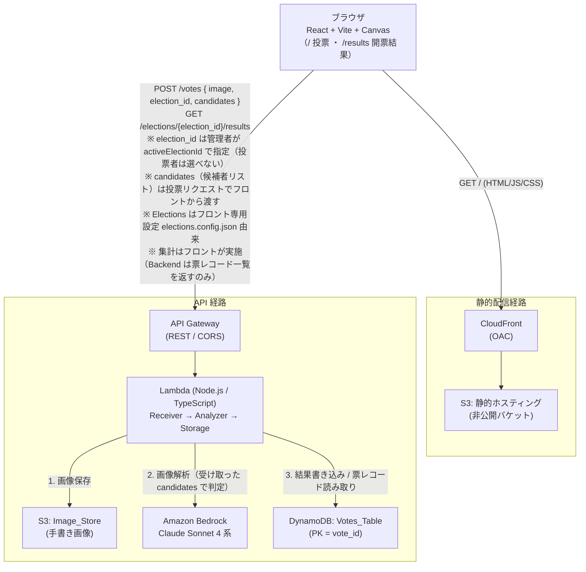
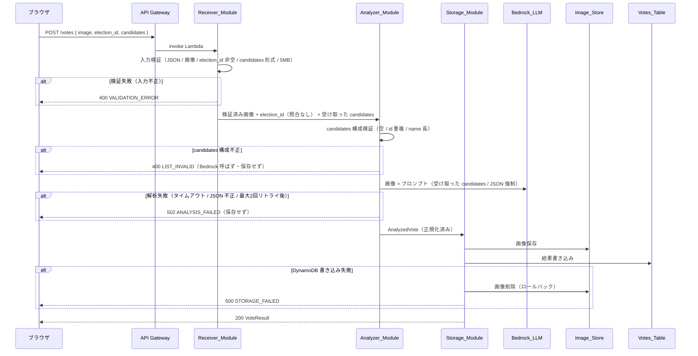
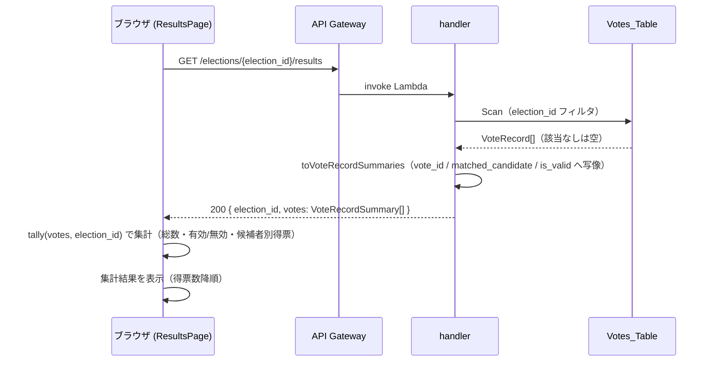

# tegaki-vote-app アーキテクチャ

手書き投票デモアプリ（tegaki-vote-app）の技術ドキュメント。日本語の候補者名を Canvas に手書きし、Amazon Bedrock のマルチモーダル LLM（Claude Sonnet 4 系）で解析して「有効票 / 無効票」を判定する、エンタメ / デモ / 学習用のネタアプリである。

読み手は 2 種類を想定する。

- このリポジトリを触る **開発者**（構成・API 契約・データモデルを把握したい）
- このデモを **動かす人**（ローカルで起動して触りたい、任意で AWS にデプロイしたい）

> **デモ用途の前提（重要）**
> 本アプリはエンタメ / デモ / 学習用である。本物の投票システムに求められる **匿名性・改竄防止・二重投票防止・監査証跡は対象外** とする。この前提のもとで最低限の保護（S3 非公開 + CloudFront OAC、CORS 設定）のみを行う。詳細は末尾「デモ用途の前提」を参照。
>
> **PoC の整合性方針**: 本アプリは PoC（概念実証）であり、シンプルさを優先する。判定基準となる **候補者リスト（Candidate_List）はクライアント（フロント）由来** で、投票リクエストに含めて backend へ渡す。backend は受け取った候補者リストをそのまま判定に用いるため、候補者リストの真正性・整合性のエンタープライズ的な保証は対象外とする。

---

## アーキテクチャ図

システムは 2 つの独立した経路を持つ。静的配信経路（フロントエンド資産の配信）と API 経路（投票処理・票レコード読み取り）である。



バックエンドは **Lambda 同期 1 本** の構成である。受付（Receiver）・解析（Analyzer）・保存（Storage）を 1 つの Lambda 内の内部モジュールとして分割し、Step Functions / SQS は採用しない。同期呼び出しで受付から結果応答までを完結させ、デモに必要な即時フィードバックを実現する。

### 投票処理のシーケンス（POST /votes）

election_id は照合せず保存ラベルとして扱う（未知 election_id の拒否＝NOT_FOUND は存在しない）。判定基準はリクエストで受け取った candidates を用い、その構成不正は判定前段で `LIST_INVALID` として弾く。



実装では `backend/src/handler.ts` が `POST /votes` を `validateVoteRequest` → `analyze`（受け取った `candidates` を渡す）→ `store` の順に配線する。解析失敗（`analyze` が失敗を返す）時点で `store` を呼ばないため、S3・DynamoDB への保存は一切行われない。`election_id` は照合せず保存ラベルとして扱うため、投票時の未知 election_id 分岐（NOT_FOUND）は存在しない。

### 開票結果取得のシーケンス（GET /elections/{id}/results）

集計は backend では行わない。backend は票レコード一覧を返し、フロントが `tally` で集計する。



---

## リポジトリ構成

npm workspaces による monorepo。ルート `package.json` の `workspaces` に `shared` / `backend` / `frontend` / `infra` を登録し、`shared` を `@tegaki/shared` パッケージとして参照する。

```
tegaki-vote-app/
├── frontend/          # React + Vite アプリ（Canvas・投票 UI・開票結果ページ・フロント集計。MSW で単体起動可）
│   ├── src/
│   │   ├── config/        # elections.config.json（フロント専用設定）+ elections.ts（ローダ/検証/findElection/getActiveElection/ELECTIONS/ACTIVE_ELECTION_ID）
│   │   ├── pages/         # VotePage（/ 投票）/ ResultsPage（/results 開票結果）
│   │   ├── logic/         # tally.ts（フロント側の開票集計。純粋関数）
│   │   ├── components/    # CanvasComponent / ActiveElectionBanner / VoteButton / VoteAnimation / CountingIndicator / ResultView / ErrorNotice
│   │   ├── api/           # VoteApi（HttpVoteApi）。HTTP のみで backend と会話
│   │   ├── mocks/         # MSW ハンドラ（handlers.ts）とブラウザワーカー（browser.ts）
│   │   ├── lib/           # 表示整形などのフロント補助（confidence 変換・線幅クランプ）
│   │   ├── App.tsx        # react-router-dom のルーティング（/ と /results）
│   │   └── main.tsx
│   ├── index.html / vite.config.ts
│   └── package.json       # @tegaki/frontend
├── backend/           # Lambda ハンドラと Receiver / Analyzer / Storage モジュール（開票回・候補者定義は持たない）
│   ├── src/
│   │   ├── handler.ts     # API Gateway プロキシ統合の handler（ルーティング + results 読み取り）
│   │   ├── modules/
│   │   │   ├── receiver.ts        # 入力検証（validateVoteRequest。candidates 形式検証・election_id 非空チェック・照合なし）
│   │   │   ├── analyzer.ts        # candidates 構成検証 + 解析結果の正規化（normalizeAnalysis）
│   │   │   ├── bedrock.ts         # Bedrock 呼び出し配線（Converse API）
│   │   │   ├── candidateList.ts   # 受け取った Candidate_List の構成的妥当性検証
│   │   │   ├── storage.ts         # S3 + DynamoDB 保存・ロールバック
│   │   │   ├── results.ts         # 票レコード写像（toVoteRecordSummaries。集計はしない）
│   │   │   └── response.ts        # VoteResult ビルダ
│   │   └── index.ts
│   └── package.json       # @tegaki/backend
├── infra/             # AWS CDK（TypeScript）スタック定義
│   ├── bin/app.ts         # CDK アプリのエントリ（StaticHostingStack + ApiStack を定義）
│   ├── lib/
│   │   ├── static-hosting-stack.ts  # 非公開 S3 + CloudFront OAC
│   │   └── api-stack.ts             # API Gateway + Lambda + DynamoDB + Image_Store + Bedrock 権限 + X-Ray
│   ├── cdk.json
│   └── package.json       # @tegaki/infra
├── shared/            # 型定義・API 契約のみ（実行ロジック・設定データ・ローダなし）
│   ├── src/
│   │   ├── types.ts       # Candidate / Election / VoteRequest / VoteResult / VoteRecordSummary / ElectionResultsResponse / ErrorResponse など
│   │   └── index.ts       # 型の再エクスポートのみ
│   └── package.json       # @tegaki/shared
└── docs/              # 本ドキュメントなど
```

### 疎結合ルール 3 点

1. **HTTP API のみで会話する**: `frontend/` と `backend/` は直接的なコード参照やモジュールインポートを行わない。両者の通信は API Gateway 経由の HTTP API のみを通じて行う。フロントは `frontend/src/api` の `VoteApi` インターフェース越しにのみ backend と会話する。
2. **`shared/` は型・API 契約のみ**: `shared/src` には TypeScript の型定義（`types.ts`）と API 契約（リクエスト / レスポンス型）のみを置く。**開票回設定データ（Elections_Config）や設定ローダは `shared/` に置かず、フロント専用として `frontend/src/config/` 配下に置く**。状態管理・I/O・副作用を伴う実行ロジックも一切含めない。`frontend/` と `backend/` は同一の `@tegaki/shared` を参照し、リクエスト / レスポンスのスキーマを一元管理する。開票回・候補者リスト・`activeElectionId` は backend が持たず、フロント専用設定として `frontend/` 配下でのみ管理される。
3. **API レスポンスは整形して返す**: `frontend/` は backend から受信した生の API レスポンスを、表示に必要な形（例: confidence を 0〜100% へ変換、票レコード一覧を `tally` で集計）へ整形してから描画する。

**Election ルックアップの扱い**: `election_id` から Election を引く `findElection` と、アクティブ開票回を引く `getActiveElection` / 定数 `ELECTIONS`・`ACTIVE_ELECTION_ID` は、開票回設定を保持する **フロント専用モジュール `frontend/src/config/elections.ts`** に置く。これは設定ファイル由来の配列に対する副作用のない検索であり、フロントのみが使用する。backend は開票回・候補者の定義を持たないため、こうしたルックアップを一切行わない。

---

## API 契約

すべての契約型は `shared/src/types.ts` に定義し、frontend / backend が同一定義を参照する。

### POST /votes

**Request**（フロントは `election_id` にアクティブ開票回の `activeElectionId` を、`candidates` にそのアクティブ開票回の Candidate_List を含めて送信する）

```json
{
  "image": "<base64 encoded PNG>",
  "election_id": "round-1",
  "candidates": [
    { "id": "candidate-1", "name": "まるまる" },
    { "id": "candidate-2", "name": "バツバツ" },
    { "id": "candidate-3", "name": "三角三角" }
  ]
}
```

backend は受け取った `candidates` をそのまま判定基準に用いる。

**Response 200**（有効票の例）

```json
{
  "vote_id": "3f2a9c1e-...",
  "recognized_text": "まるまる",
  "matched_candidate": "まるまる",
  "is_valid": true,
  "confidence": 0.92,
  "reason": "候補者リストの『まるまる』と一致",
  "created_at": "2026-04-01T12:34:56Z"
}
```

**Response 200**（無効票の例。`matched_candidate = null`、判読不能時は `recognized_text = null`）

```json
{
  "vote_id": "8b7d...",
  "recognized_text": "しかく",
  "matched_candidate": null,
  "is_valid": false,
  "confidence": 0.61,
  "reason": "いずれの候補者とも一致しなかった",
  "created_at": "2026-04-01T12:35:10Z"
}
```

- `election_id` フィールドが欠落・空 → 入力不正として **400 `VALIDATION_ERROR`**。
- `election_id` は保存用ラベルとして非空チェックのみ行い、**開票回定義との照合は行わない**（backend は Elections を持たないため未知 election_id の拒否は存在しない）。
- `candidates` フィールドが欠落・非配列・要素が `id`/`name` を持たない → **400 `VALIDATION_ERROR`**（形式検証）。
- 受け取った `candidates` が構成的に不正（空・`id` 重複・`name` が 1〜50 文字でない）→ 判定前段で **400 `LIST_INVALID`**。

### GET /elections/{election_id}/results

backend は指定 `election_id` を保存ラベルとして扱い、**当該 `election_id` を持つ票レコード一覧を返す**（集計は行わない）。集計（総数・有効/無効・候補者別得票）はフロントの `tally` が行う。

**Response 200**

```json
{
  "election_id": "round-1",
  "votes": [
    { "vote_id": "3f2a9c1e-...", "matched_candidate": "まるまる", "is_valid": true },
    { "vote_id": "8b7d...", "matched_candidate": null, "is_valid": false },
    { "vote_id": "1c4e...", "matched_candidate": "バツバツ", "is_valid": true }
  ]
}
```

- 各レコード（`VoteRecordSummary`）はフロント集計に必要な `matched_candidate` と `is_valid`、識別用の `vote_id` を含む。
- 指定 `election_id` を持つ票レコードが存在しない場合は空配列 `"votes": []` を返す。backend は開票回定義を持たないため、未知 election_id でも照合・拒否は行わず単に該当なし（空配列）として扱う。

### エラーレスポンス形式

全エラーは共通ボディ形式を返す。

```json
{
  "error": {
    "code": "VALIDATION_ERROR",
    "message": "election_id は必須です"
  }
}
```

| HTTP ステータス | code | 発生源 |
|---|---|---|
| 400 | `VALIDATION_ERROR` | 入力不正（JSON 不正 / 画像欠落・非 PNG / election_id 欠落・空 / candidates 形式不正 / 5MB 超） |
| 400 | `LIST_INVALID` | 受け取った candidates の構成不正（空 / id 重複 / name 長） |
| 502 | `ANALYSIS_FAILED` | 上流 LLM 起因の解析失敗（JSON 不正 / タイムアウト / リトライ全滅） |
| 500 | `STORAGE_FAILED` | 保存失敗（S3 / DynamoDB、リトライ全滅） |

**election_id の扱い（設計判断）**: backend は開票回定義を持たないため、投票時（POST /votes）・開票時（GET results）ともに `election_id` を **保存用ラベル** として受け入れ、開票回定義との照合や未知 election_id の拒否（`NOT_FOUND`）は行わない。`NOT_FOUND` はエラーコードから廃止した。`election_id` フィールド自体の欠落・空のみ入力形式の不備として `VALIDATION_ERROR`/400 とする。GET results では、指定 election_id を持つレコードがなければ空配列を返す。

**candidates 不正のマッピング（設計判断）**: `candidates` の **形式不正**（欠落・非配列・要素が id/name を持たない）は受付検証段階で `VALIDATION_ERROR`/400。受け取った `candidates` の **構成不正**（空・id 重複・name 長）は判定前段の Analyzer で `LIST_INVALID`/400。

**CONFIG_INVALID の扱い（設計判断）**: `CONFIG_INVALID` は Elections_Config を検証するフロントの **ビルド時** 専用のコードであり、backend の API レスポンスには現れない。設定不正は Frontend のビルド失敗として提示される（後述「開票回の仕組み」参照）。

---

## 開票回（Election）の仕組み

1 つのアプリを **忘年会の会場投票など複数のシーンに流用** するため、投票・開票の単位である **Election（開票回）** を複数定義する。各 Election は `election_id`・`title`・`Candidate_List` を持つ。

**フロント専用設定 + 投票者は選択しない**: Election 群と、現在投票を受け付けている **アクティブ開票回を示す `activeElectionId`** は、コードにハードコードせず **フロントエンド専用の設定ファイル `frontend/src/config/elections.config.json`（Elections_Config）** で管理する。backend は開票回・候補者の定義を一切持たず、この設定を参照しない。投票者は開票回を選択できず、フロントは `activeElectionId` に対応する Election を **固定表示** する（`ActiveElectionBanner`）。管理者は設定ファイルを編集して Frontend をデプロイ / 再ビルドすることで開票回・候補者を差し替え、`activeElectionId` を編集して現在の開票回を切り替える（UI 管理画面なし）。

```json
// frontend/src/config/elections.config.json（Elections_Config）— 管理者が編集するフロント専用設定
{
  "activeElectionId": "round-1",
  "elections": [
    {
      "election_id": "round-1",
      "title": "第1回 開票",
      "candidates": [
        { "id": "candidate-1", "name": "まるまる" },
        { "id": "candidate-2", "name": "バツバツ" },
        { "id": "candidate-3", "name": "三角三角" }
      ]
    },
    { "election_id": "round-2", "title": "第2回 開票", "candidates": [] },
    { "election_id": "round-3", "title": "第3回 開票", "candidates": [] }
  ]
}
```

- **スキーマ**: トップレベルはオブジェクトで、`activeElectionId`（文字列）と `elections`（Election の配列）を並置する。`activeElectionId` は `elections` 内のいずれかの `election_id` を指す。
- **ローダ / 検証**: `frontend/src/config/elections.ts` が JSON を import で取り込み（`resolveJsonModule`）、`validateElectionsConfig`（副作用のない純粋関数）で形状・`election_id` 一意性・candidate の id 一意性 / name 長（1〜50 文字）・`activeElectionId` と `elections` の整合を検証する。妥当なら型付きの `ELECTIONS: readonly Election[]` と `ACTIVE_ELECTION_ID: string` を export し、参照ヘルパ `findElection(id)` / `getActiveElection()` を提供する。検証は **ビルド時（バンドル評価時）** に走り、不正な設定は `CONFIG_INVALID` として例外を投げてビルドを失敗させる。この検証はフロント専用で、backend の API レスポンスには現れない。
- **アクティブ開票回の固定表示**: `VotePage` が `getActiveElection()` でアクティブ Election を確定し、`ActiveElectionBanner` がそのタイトルと Candidate_List を表示する。開票回セレクタ（旧 `ElectionSelector`）は廃止した。投票時は `ACTIVE_ELECTION_ID` を `election_id`、アクティブ開票回の Candidate_List を `candidates` としてリクエストに含める。
- **設定不正時のフォールバック**: `activeElectionId` が `elections` のいずれの `election_id` にも該当しない場合、通常はビルド時検証で弾かれる。実行時ガードとして `getActiveElection()` が例外を投げた場合、フロントは投票不可にし「現在、投票を受け付けていません」旨を表示する。
- **round-1（第1回）**: サンプルの具体名 まるまる / バツバツ / 三角三角 を定義済み。すぐに動かせる。
- **round-2 / round-3（第2回 / 第3回）**: `candidates` が空配列のプレースホルダ。別のシーンで使うとき候補者を後から追加する。

> **空プレースホルダ Election の扱い**: `round-2` / `round-3` は候補者未定義（空配列）である。空リストはフロントの設定検証では許容される（`candidates` は配列であればよい）が、この状態で当該開票回の投票が backend に届くと、判定前段の構成検証で `LIST_INVALID`（空リスト）として弾かれる。候補者を定義してから運用に供する前提とする。

---

## 開票結果ページとフロント集計

- **ページ**: `/results`（`frontend/src/pages/ResultsPage.tsx`）。投票ページ `/` と相互リンクする（`react-router-dom` v6）。
- **取得**: マウント時にアクティブ開票回の `election_id` で `GET /elections/{election_id}/results` を呼び、**票レコード一覧**（`VoteRecordSummary[]`）を取得する。backend は集計しない。
- **集計**: `frontend/src/logic/tally.ts` の純粋関数 `tally(votes, electionId)` が集計する。
  - `total = valid + invalid`
  - `is_valid = true` を `matched_candidate` ごとに集計し、得票数の降順（同数は候補者名昇順で決定的）に並べる
  - `is_valid = false` は得票集計から除外し `invalid` にのみ計上
  - 票が 0 件のとき `total = valid = invalid = 0`、`tally = []`（「まだ投票がありません」を表示）
- **表示**: アクティブ開票回のタイトル、総投票数 / 有効票数 / 無効票数、候補者ごとの得票数（降順テーブル）。取得中はローディング、通信失敗時はエラー表示。

## 投票後の結果表示（簡素化）

投票ページ `/` の投票後表示（`ResultView`）は **簡素化** されており、判定詳細（有効/無効・matched_candidate・confidence・reason）は表示せず「投票されました」旨のみを表示する。詳細な集計は開票結果ページ `/results` で確認する。

---

## Bedrock（画像解析）

- **モデル**: Claude Sonnet 4 系のマルチモーダルモデルを **推論プロファイル ID 経由** で呼び出す（`backend/src/modules/bedrock.ts` の Converse API）。
- **モデル ID の差し替え**: Lambda 環境変数 `BEDROCK_MODEL_ID` でモデル ID を差し替え可能。未設定時のデフォルトは推論プロファイル形式（`DEFAULT_BEDROCK_MODEL_ID = "apac.anthropic.claude-sonnet-4-20250514-v1:0"`）。
- **リージョン依存の注意**: 推論プロファイル ID のプレフィックスはデプロイ先リージョンにより異なる（米国系 `us.` / アジアパシフィック `apac.` / 欧州 `eu.`）。デプロイ先に合わせた ID を `BEDROCK_MODEL_ID` で指定する。
- **呼び出し方針**: 30 秒タイムアウト（`AbortController`）で呼び出し、タイムアウト / エラー / JSON パース失敗時は最大 2 回リトライ。全滅時は `ANALYSIS_FAILED` を返す。
- **プロンプト**: システムプロンプトに **リクエストで受け取った** `candidates`（Candidate_List）を埋め込み、`recognized_text` / `matched_candidate` / `is_valid` / `confidence` / `reason` を含む JSON のみで応答するよう強制する。表記ゆれ・ひらがな/漢字ゆれ・姓のみなどはゆるめに一致扱いにしてよいが、明らかに別人・判読不能なら `is_valid=false`。
- **多層防御**: LLM 応答はそのまま信用せず、`analyzer.ts` の純粋関数 `normalizeAnalysis` で正規化・再検証する。`matched_candidate` が受け取った候補者集合に含まれるかをコード側で再検証し、`confidence < 0.5` は判読不能として無効化（`recognized_text=null`・`matched_candidate=null`・`is_valid=false`）、confidence の範囲外・欠落は `0.0` かつ `is_valid=false` に丸める。なお本 PoC では候補者リストがクライアント由来のため、リスト自体の真正性は保証対象外である。

> **現状**: 実 AWS へは未デプロイであり、Bedrock の実呼び出しは未実施。フロントは MSW モックの応答で動作確認している段階である。

---

## データモデル

### DynamoDB: Votes_Table

パーティションキーは `vote_id`（UUID）。1 投票 = 1 レコード。

| 属性 | 型 | 説明 |
|---|---|---|
| `vote_id` (PK) | String (UUID) | パーティションキー。一意 |
| `election_id` | String | 開票回識別子（例: `round-1`）。保存ラベル |
| `image_key` | String | S3 画像キー |
| `recognized_text` | String \| Null | 読み取りテキスト（判読不能時 null） |
| `matched_candidate` | String \| Null | 一致候補者名（なしは null） |
| `is_valid` | Boolean | 有効票判定 |
| `confidence` | Number | 0.0〜1.0 |
| `reason` | String | 判定理由 |
| `created_at` | String | ISO 8601 UTC（`YYYY-MM-DDThh:mm:ssZ`） |

### S3: Image_Store

- 手書き画像 PNG を保管。オブジェクトキーは `votes/{election_id}/{vote_id}.png` 形式（`storage.ts` が生成）。ContentType は `image/png`。
- 非公開バケット。

### 将来の GSI（後付け可能）

票レコードの読み取りを効率化するため、`election_id` をパーティションキーとする GSI を後から追加できる。v1 では `Votes_Table` のスキャン + `election_id` フィルタで読み取る（`handler.ts` の `readVotesByElection`）。デモ規模（想定 ~50 人）では十分。全レコードが `election_id` を保持するため、GSI 追加はスキーマ変更なしで行える。集計はフロントが行うため、backend の集計コストは発生しない。

### 環境変数

Lambda（backend）が参照する環境変数。

| 環境変数 | 用途 | 参照箇所 |
|---|---|---|
| `IMAGE_BUCKET` | Image_Store の S3 バケット名 | `storage.ts` `storageConfigFromEnv` |
| `VOTES_TABLE` | Votes_Table の DynamoDB テーブル名 | `storage.ts` / `handler.ts` `readVotesByElection` |
| `BEDROCK_MODEL_ID` | Bedrock モデル ID（推論プロファイル ID）。未設定時はデフォルト | `bedrock.ts` |

フロント（Vite）が参照する環境変数。

| 環境変数 | 用途 |
|---|---|
| `VITE_API_BASE_URL` | backend API のベース URL。未設定なら同一オリジン相対パスへ発行 |
| `VITE_ENABLE_MOCKS` | MSW モックの有効化。未指定時は dev のみ有効 |

---

## ローカル開発・実行方法

monorepo は npm workspaces で管理する。ルートで依存をインストールする。

```bash
npm install
```

ルートで使える主なスクリプト（`package.json`）:

```bash
npm run build         # 全 workspace をビルド
npm run typecheck     # tsc --build
npm run lint          # ESLint
npm run format        # Prettier
```

### frontend を MSW モックで単体起動する（backend 不要）

frontend は MSW（Mock Service Worker）で `POST /votes` と `GET /elections/{id}/results` の応答をモックするため、backend や AWS がなくても単体で動かせる。dev 起動時はデフォルトでモックが有効になる。

```bash
cd frontend
npm run dev
```

`http://localhost:5173`（Vite デフォルト）で起動する。ルーティングは 2 ページ構成:

- `/` … 投票ページ（`VotePage`）。手書き → 投票 → 「投票されました」表示。
- `/results` … 開票結果ページ（`ResultsPage`）。アクティブ開票回の票レコードを取得しフロントで集計表示。

MSW は `frontend/src/mocks/handlers.ts` の応答を返し、`main.tsx` が dev 時に MSW ワーカーを起動する。実 backend に向けたい場合は `VITE_ENABLE_MOCKS=false` を設定し、`VITE_API_BASE_URL` に API のオリジンを指定する。

### backend のビルド

```bash
cd backend
npm run build     # tsc --build → dist/ に出力
```

backend は Node.js Lambda（`type: module`）。`handler.ts` の `handler` が API Gateway プロキシ統合のエントリ。ローカル実行時は上記の環境変数（`IMAGE_BUCKET` / `VOTES_TABLE` / `BEDROCK_MODEL_ID`）が必要。

### infra（AWS CDK）の synth

```bash
cd infra
npm run synth     # cdk synth（CloudFormation テンプレートを合成）
npm run build     # tsc --build
```

`infra/bin/app.ts` が CDK アプリのエントリで、2 つのスタックを定義する。

- `StaticHostingStack`（`TegakiVoteStaticHostingStack`）… 非公開 S3 + CloudFront OAC の静的配信。
- `ApiStack`（`TegakiVoteApiStack`）… API Gateway（REST / CORS）+ Lambda（NodejsFunction）+ DynamoDB（Votes_Table）+ Image_Store（S3）+ Bedrock InvokeModel 権限 + X-Ray トレース。

`cdk synth` までは確認済み。

### 実 AWS へのデプロイ（任意）

デモ用途のため実 AWS へのデプロイは任意。行う場合は infra で `cdk deploy` を実行する（AWS 認証情報と、必要なら `cdk bootstrap` が前提）。

```bash
cd infra
npx cdk deploy --all
```

---

## デモ用途の前提

本アプリは **エンタメ / デモ / 学習用** であり、本物の投票システムに求められる以下は **対象外** とする。

- **匿名性**: 投票者の匿名化・秘匿は行わない。
- **改竄防止**: 投票データの改竄検知・防止（署名・台帳等）は行わない。
- **二重投票防止**: 同一人物による複数投票の抑止は行わない。
- **監査証跡**: 監査ログ・追跡可能性の保証は行わない。

さらに **PoC の整合性方針** として、判定基準となる候補者リストは **クライアント（フロント）由来** で投票リクエストに含めて渡す。backend は受け取った `candidates` を信頼して判定するため、候補者リストの真正性・改竄防止は保証対象外とする（構成的な妥当性＝空・id 重複・name 長のみ判定前に検証する）。

この前提のもとで、最低限の保護のみを行う。

- **S3 バケット非公開 + CloudFront OAC**: 静的配信バケットも Image_Store も非公開とし、静的配信は CloudFront + OAC 経由でのみアクセス可能にする。バケットへの直接パブリックアクセスは遮断する。
- **CORS**: API Gateway に CORS を設定し、`POST /votes` と `GET /elections/{id}/results` を許可する（handler もレスポンスに CORS ヘッダを付与する）。v1 のデモ用途では全オリジン許可（緩め）で、本番相当では CloudFront ドメインに絞る。
- **トレーサビリティ**: Lambda と下流呼び出し（S3 / Bedrock / DynamoDB）に AWS X-Ray を有効化し、遅延要因（主に Bedrock レイテンシ）を切り分けやすくする。

主コストは Bedrock のマルチモーダル推論呼び出し。DynamoDB / S3 / Lambda はデモ規模（想定 ~50 人）では軽微であり、Lambda 同期 1 本の構成で十分にさばける。

---

## 現状のステータス

- **フロントエンド**: MSW モックで単体動作（投票フロー・開票結果ページとも確認可能）。2 ページ構成（`/`・`/results`）。
- **バックエンド**: 受付・解析・保存・results 読み取りのロジックは実装済みだが、**実 AWS へは未デプロイ**。Bedrock の実呼び出しも未実施で、フロントはモック応答で動作確認している段階。
- **インフラ**: CDK で静的配信スタックと API スタックを定義済み（`cdk synth` まで確認）。実デプロイは任意。
- **テスト**: 未整備（後回し）。
